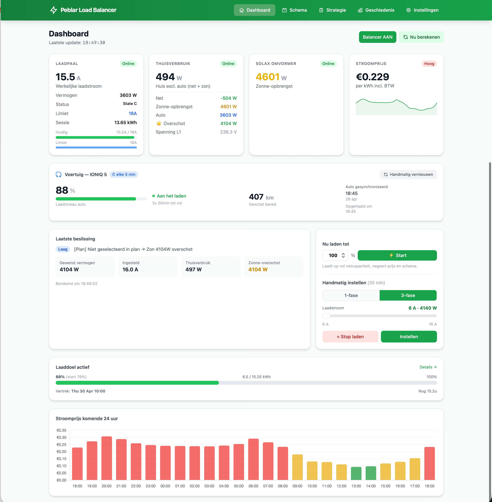
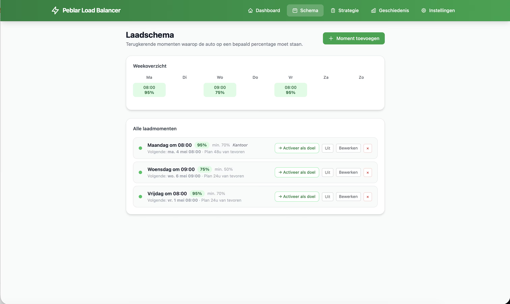
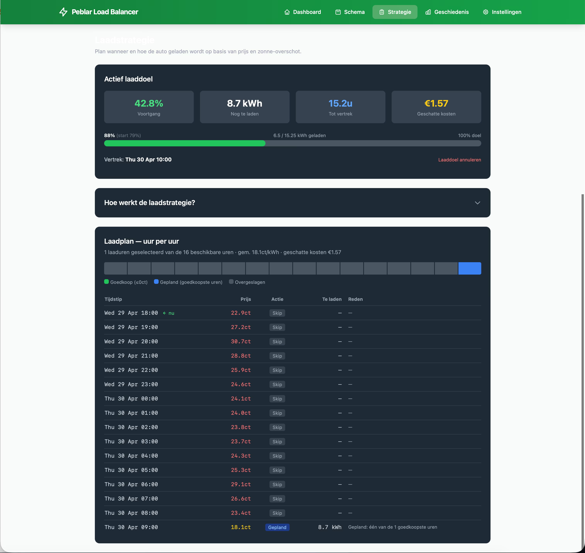
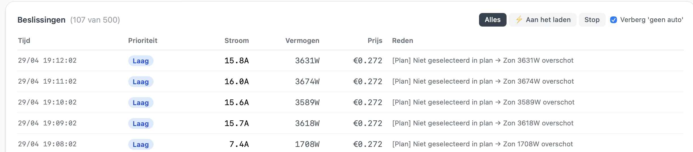

# Peblar Load Balancer

Dynamische laadsturing voor de [Peblar Home](https://peblar.com/) laadpaal op basis van:

- **P1 smart meter** (Slimmelezer) — live huishoudverbruik
- **Solax omvormer** — zonne-opbrengst en thuisbatterij (optioneel)
- **Zonneplan API** — day-ahead dynamische stroomprijzen (optioneel)
- **Hyundai BlueLink** — SoC en laadstatus (optioneel, uitbreidbaar naar andere auto's)

Het systeem herberekent elke minuut het optimale laadvermogen: zoveel mogelijk
zonne-overschot benutten, goedkoopste uren plannen, en de groepenkast nooit
overbelasten.

> **Disclaimer.** Persoonlijk hobbyproject zonder enige garantie. Je gebruikt
> het op eigen risico. Controleer zelf dat groepenkast-zekering en bekabeling
> het gekozen laadvermogen aankunnen.

---

## Screenshots


*Dashboard — live overzicht van laadpaal, P1, omvormer en auto.*


*Schema — energiestromen tussen net, zon, batterij, huis en auto.*


*Strategie — instellingen voor smart-charging en limieten.*


*Beslissingen — log van waarom de load balancer welk vermogen koos.*

---

## Snelstart (Docker)

Vereist: Docker + Docker Compose.

```bash
git clone https://github.com/<jouw-fork>/peblar-loadbalancer.git
cd peblar-loadbalancer
cp .env.example .env
# Vul minimaal PEBLAR_IP, PEBLAR_TOKEN en P1_IP in
docker compose up -d --build
```

Open http://localhost:8000. Bij eerste start wordt automatisch een `APP_KEY`
gegenereerd, een SQLite database aangemaakt en migraties uitgevoerd. Database
en logs zijn persistent via `./data` en `./logs`.

Verdere instellingen (drempels, limieten, schema) via de webinterface onder
**Instellingen**.

### Vereiste integraties

| Bron | Doel | Hoe in te stellen |
|------|------|-------------------|
| Peblar Home | Laadpaal aansturen | IP + API token via Local API in webinterface laadpaal |
| Slimmelezer P1 | Live netto verbruik | Lokaal IP-adres (geen auth) |

### Optionele integraties

| Bron | Doel |
|------|------|
| Solax omvormer | Zonne-opbrengst + thuisbatterij stand |
| Zonneplan | Dynamische uurprijzen voor smart-charging |
| Hyundai BlueLink | SoC, laadstatus, range van Ioniq 5 etc. |

Laat de bijbehorende `.env`-velden leeg om een integratie uit te schakelen.

---

## Lokale ontwikkeling (zonder Docker)

Vereist: PHP 8.4, Composer, Node 22, SQLite, Python 3 (alleen voor Hyundai).

```bash
composer install
npm install && npm run build
cp .env.example .env
php artisan key:generate
touch database/database.sqlite
php artisan migrate
php artisan serve
```

### Scheduler (alleen non-docker)

De load balancer draait elke minuut via Laravel's scheduler. In de **Docker
setup is dit al ingebouwd** (supervisord houdt `schedule:work` permanent
draaiend) — niets doen. Bij **non-docker self-host** moet je zelf een trigger
opzetten:

Optie 1 — crontab (`crontab -e`):
```cron
* * * * * cd /path/to/peblar && php artisan schedule:run >> /dev/null 2>&1
```

Optie 2 — permanente worker onder systemd/supervisord:
```bash
php artisan schedule:work
```

---

## Forken & uitbreiden

Het idee van deze repo is dat anderen hem **forken** en hun eigen hardware
inpluggen — Tesla, BMW, Enphase, GroWatt, Tibber, ANWB Energie, etc.

Alle externe integraties zitten in `app/Services/` als losse service per
leverancier:

| Service | Verantwoordelijkheid |
|---------|----------------------|
| `PeblarService`     | Laadpaal lezen + schrijven |
| `P1MeterService`    | Smart meter SSE-stream |
| `SolaxService`      | Omvormer + thuisbatterij |
| `ZonneplanService`  | Dynamische prijzen |
| `HyundaiService`    | Auto SoC + laadstatus |
| `LoadBalancerService` | Beslissingslogica (consumer van bovenstaande) |

**Adapter-storyline:** wil je een andere auto, omvormer of prijsbron? Schrijf
een service met dezelfde public methods (zie [`AGENT.md`](AGENT.md) voor de
contracten) en bind die in `AppServiceProvider`. Geen core-aanpassingen nodig.

PR's welkom voor integraties die generiek genoeg zijn om mee te releasen.

---

## Architectuur

Diep duik: zie [`AGENT.md`](AGENT.md). Korte historische context:
[`PLAN.md`](PLAN.md). Wijzigingen per release: [`CHANGELOG.md`](CHANGELOG.md).

---

## Bijdragen

Zie [`CONTRIBUTING.md`](CONTRIBUTING.md).

## Veiligheid

Security issue gevonden? Zie [`SECURITY.md`](SECURITY.md).

## Licentie

[MIT](LICENSE) © 2026 Eric Mulder
